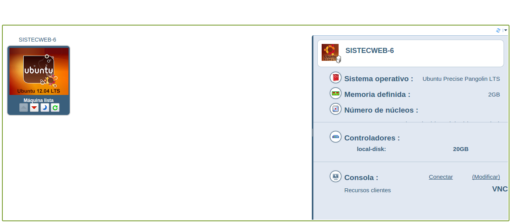
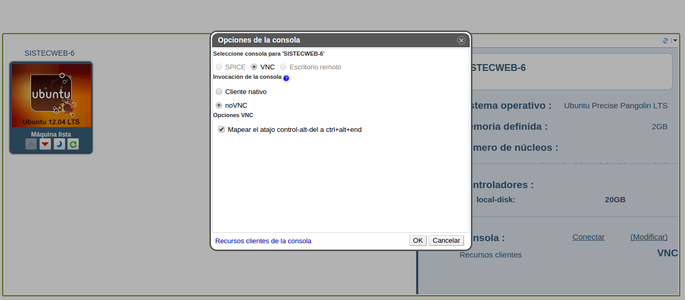
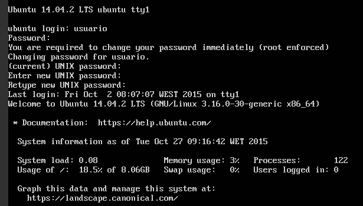

STW: iaas.ull.es
===================
Quinta práctica de la asignatura de Sistemas y Tecnologías Web donde se instalará la práctica anterior en el servicio iaas de la ull.

----------

Pasos Previos
-------------

Para empezar entramos en el sitio web **[iaas.ull.es](http://iaas.ull.es/)** y entramos en el apartado de "**portal de usuario**" y ponemos nuestras credenciales (aluXXXXXXXX y contraseña).

A continuación nos aparecerá un entorno con una máquina virtual que hay que encender.

Antes de conectarse a ella hay que clicar en "**modificar**" y marcar la opción de "**no VNC**".

Lo siguiente que haremos será abrir la máquina virtual y loguearnos.

Una vez dentro ejecutaremos el comando "**ifconfig**" para saber nuestra dirección IP y poder entrar a nuestra cuenta en iaas desde cualquier terminal.

----------

Alojando la Práctica en el servidor
-------------
Empezaremos por modificar el fichero "**static_server**", al cual hay que añadirle la IP que recogimos en el apartado anterior: 

> **console.log("Visit http://DirecionIP/index.html")**

A continuación pasaremos a instalar "**node-static**" junto a las otras dependencias en el "**package.json**". Esto se hace con el comando:

> **npm install node-static --save-dev**

Una vez hemos hecho esto pasaremos a clonar nuestro repositorio dentro de iaas con un **git clone**.

Por último debemos instalar las dependencias. Para ello tenemos que instalar primero **npm** en el servidor. Esto se hace con el comando:

> **sudo apt-get install npm**

Ahora solo hace falta hacer un **npm install** y listo, ya tenemos instaladas todas nuestras dependencias.

Con el comando:

> **sudo nodejs static_server**

Podremos correr nuestra aplicación en el servidor.

----------
- **Autor:** *Alejandro Ravelo Moreno*
- **Sistema Operativo:** *Linux*
- **Página Desplegada en iaas.ull.es:** http://10.6.128.78:8080/index.html
- **Página Personal de GitHub:** http://alu0100763379.github.io/

